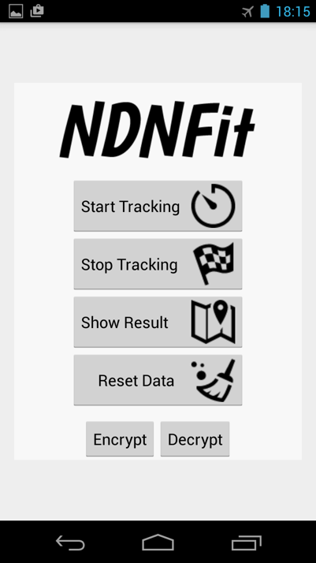

Zhehao Wang <zhehao@cs.ucla.edu> Haitao Zhang <zhtaoxiang@gmail.com> Wang Yang <xxyangwang@gmail.com>

NDNFit Android application based on professor Jung's work. Did not fork as we don't have access to the original work on BitBucket.

Jan 20, 2015 - v0.1

### What it does:
* Capture time-location data (Use NETWORK\_PROVIDER instead of GPS\_PROVIDER for GPS for now)
* Use the identity provided by <a href = "https://github.com/zhehaowang/android-identity-manager/releases"> Android Identity Manager </a> to sign the captured data
* "Upload" captured data to the DSU running on remap server memoria.ndn.ucla.edu

### How to use:
* Install ndnfit, identity manager, and nfd-android on Android device
  * Ndnfit: <a href = "https://github.com/zhehaowang/ndnfit/releases">download</a>
  * Identity Manager: <a href = "https://github.com/zhehaowang/android-identity-manager/releases">download</a>
  * Nfd-Android: <a href = "https://play.google.com/apps/testing/net.named_data.nfd">download</a>
* Open NFD-Android (the <a href = "https://github.com/named-data-mobile/NFD-android">link</a> to github repo), and configure it. Need to connect nfd-Android to the NDN testbed (the best choice is remap server memoria.ndn.ucla.edu) and configure route.
  * Step 1: open the app, click "general"
  * Step 2: choose “faces” or “routes”
  * Step 3: click the “+” to add face after choosing "faces"
  * Step 4: click the “+” to add route after choosing "routes"

* Open identity manager, request an NDNFit identity (see the <a href = "https://github.com/zhehaowang/android-identity-manager">steps</a>)
* Open ndnfit to capture and upload data
  * Choose an identity to use with the help of Identity Manager
  * Click “start tracking” to start to capture data
  * Click “stop tracking” to stop capturing data. The captured data will be uploaded to DSU within ten minutes
  * Click “show result” to show path on google map locally
  * Click “Reset Data” to clear local cache
  * “Encrypt” and “Decrypt” function have not been added yet

### Known Issues:
* Nfd-Android stops working after about 20 minutes unless refresh it periodically
* The DSU (which uses <a href = "https://github.com/named-data/repo-ng"> Repo-ng </a>) is not robust enough. The number of data packets it can hold is limited.

### Development:

* Open in Android Studio, SDK 21, build tools 21.1.2; sync Gradle
